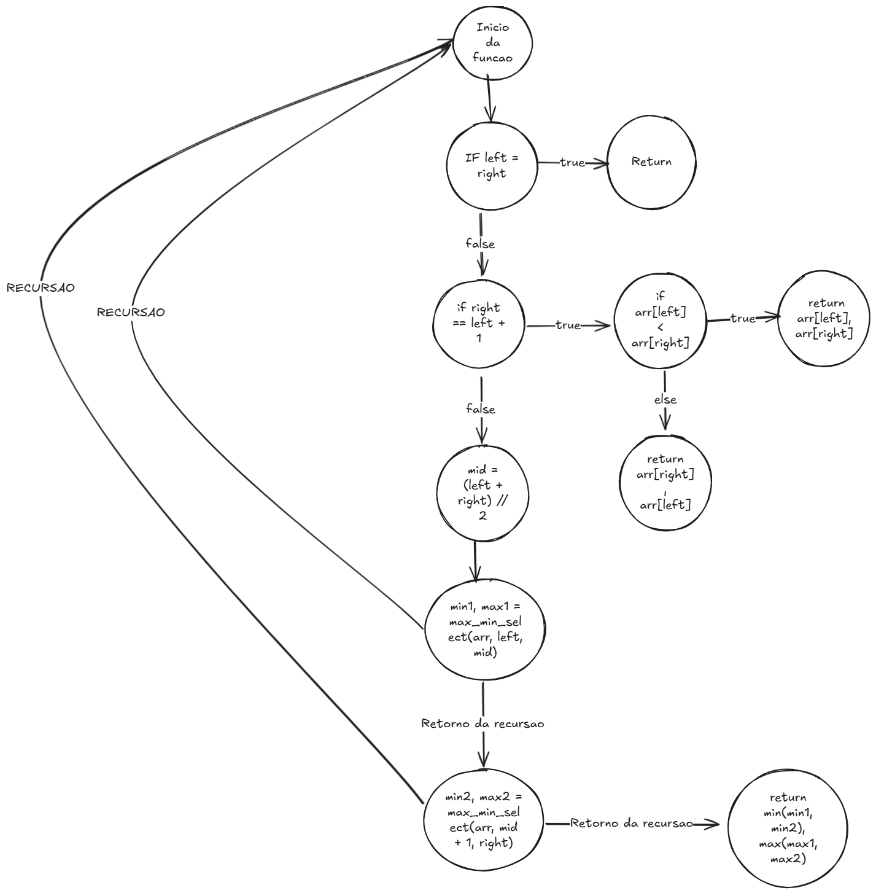

# MaxMin Select - Relatório Técnico


## Descrição do Projeto

Este projeto consiste na implementação do algoritmo de seleção simultânea do maior e do menor elementos (*MaxMin Select*) utilizando a abordagem de divisão e conquista. O objetivo é reduzir o número de comparações necessárias em relação a uma abordagem ingînua, tornando a busca mais eficiente.

## Como Executar o Projeto

### Requisitos

- Python 3.x instalado

### Execução

1. Clone o repositório:
   ```sh
   git clone https://github.com/RenatoMAP77/MaxMinSelect.git
   ```
2. Acesse o diretório do projeto:
   ```sh
   cd src
   ```
3. Execute o script principal:
   ```sh
   python main.py
   ```
4. O programa irá processar a lista de entrada e exibir o menor e o maior elemento encontrado.

## Lógica do Algoritmo

O algoritmo *MaxMin Select* segue os seguintes passos:

1. Se o array contém apenas um elemento, ele é tanto o menor quanto o maior.
2. Se contém dois elementos, a comparação direta determina o menor e o maior.
3. Se contém mais de dois elementos:
   - O array é dividido em duas metades.
   - O algoritmo é chamado recursivamente para cada metade.
   - Os resultados são combinados para obter o menor e o maior elementos.

## Análise da Complexidade Assintótica

### O que é complexidade assintótica?

A complexidade assintótica de um algoritmo descreve como o tempo de execução ou o uso de recursos cresce à medida que o tamanho da entrada aumenta. Essa análise é fundamental para compreender a eficiência de um algoritmo e comparar diferentes abordagens para resolver um mesmo problema. As principais notações utilizadas são:

- **O(𝑛)** (*BigO*): Representa um limite superior assintótico. Indica que o pior caso do algoritmo cresce no máximo na taxa especificada.
- **Ω(𝑛)** (*Ômega*): Representa um limite inferior assintótico, garantindo que o algoritmo leva pelo menos essa quantidade de tempo no melhor caso.
- **Θ(𝑛)** (*Theta*): Indica que o tempo de execução cresce exatamente na taxa especificada.

### Contagem de Operações

- O algoritmo realiza aproximadamente `3n/2` comparações, uma redução significativa em relação à abordagem ingênua de `2(n-1)`.
- A divisão do problema e a combinação dos resultados resultam em complexidade `O(n)`.

A recorrência que descreve o número de operações é:

$$
T(n) = 2T(n/2) + 2
$$

Podemos resolver essa equação usando o método da árvore de recorrência:

- Nível 0: \(T(n)\)
- Nível 1: \(2T(n/2) + 2\)
- Nível 2: \(4T(n/4) + 4\)
- Nível \(k\): \(2^k T(n/2^k) + 2^k\)

Como o processo continua até que \(n/2^k = 1\), então \(k = \log_2 n\). Substituindo na soma de operações:

$$
T(n) = O(n)
$$

### Análise pelo Teorema Mestre

A relação de recorrência do algoritmo é:
$$
T(n) = 2T(n/2) + O(1)
$$

Para encontrar a complexidade assintótica, aplicamos o **Teorema Mestre**, que resolve recorrências da forma:

$$
T(n) = aT(n/b) + f(n)
$$

#### **1. Identificação dos valores de \(a\), \(b\) e \(f(n)\):**
- \( a = 2 \) (duas chamadas recursivas)
- \( b = 2 \) (problema dividido ao meio)
- \( f(n) = O(1) \) (operação de combinação)

#### **2. Cálculo de \( n^{\log_b a} \):**
$$
 n^{\log_2 2} = n^1 = n
$$

#### **3. Os três casos do Teorema Mestre:**

- **Caso 1:** Se **( f(n) < n log_b a ), então ( T(n) = O(n^p) ).**   
- **Caso 2:** **( f(n) = n log_b a ), então ( T(n) = O(n^p \log n) ).** 
- **Caso 3:** **( f(n) > n log_b a ), então  T(n) = O(f(n)  ).**

Aqui, temos que \( f(n) = O(1) \), que é menor do que \( n^1 \). Isso significa que o algoritmo se encaixa no **Caso 1** do Teorema Mestre.

#### **4. Solução assintótica:**
$$
T(n) = O(n^1) = O(n)
$$

O algoritmo possui complexidade **O(n)**, o que confirma que seu tempo de execução cresce linearmente com o tamanho da entrada.

## Diagrama do Algoritmo

Um diagrama ilustrando a divisão e combinação dos subproblemas está disponível na pasta `assets/fluxoExecucao.png`.



## Conclusão

O algoritmo *MaxMin Select* demonstra eficiência na seleção simultânea do maior e do menor elemento de uma lista, reduzindo significativamente o número de comparações necessárias. A análise confirma que a complexidade assintótica do algoritmo é `O(n)`, tornando-o ideal para listas de grande tamanho.

## Referências

- [AULA 01\_Análise de complexidade de algoritmos.pdf](https://github.com/joaopauloaramuni/fundamentos-de-projeto-e-analise-de-algoritmos/tree/main/PDF)
- Material do curso de Fundamentos de Projeto e Análise de Algoritmos.

